# wpaperd State Diagrams

> [!NOTE]
> Written by an LLM (Qwen3.6-33B-A3B); there may be inaccurracies.

Comprehensive state diagrams for the `wpaperd` daemon's surface lifecycle, timer management, and wallpaper pipeline. These diagrams are essential for reasoning about the code and for the ongoing refactoring of `surface.rs`.

---

## 1. High-Level Surface Lifecycle

The `Surface` struct manages a single Wayland layer-shell surface for one output. The lifecycle spans from surface creation through wallpaper rendering.

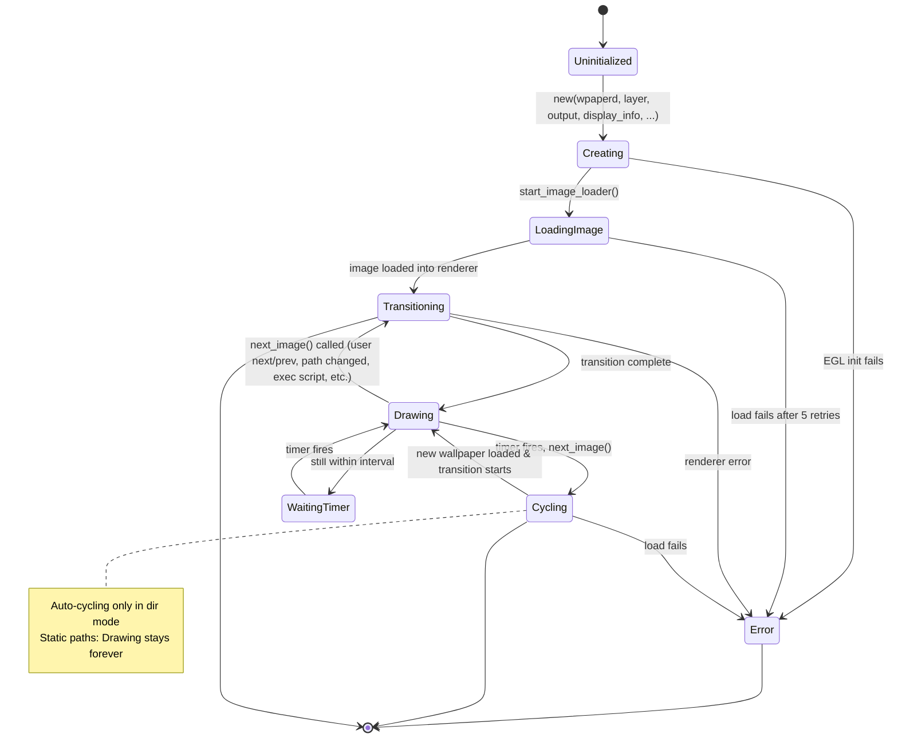

---

## 2. EventSource Timer States

This is the core timer state machine governing automatic wallpaper cycling. The timer is managed via `calloop\:\:Timer`.

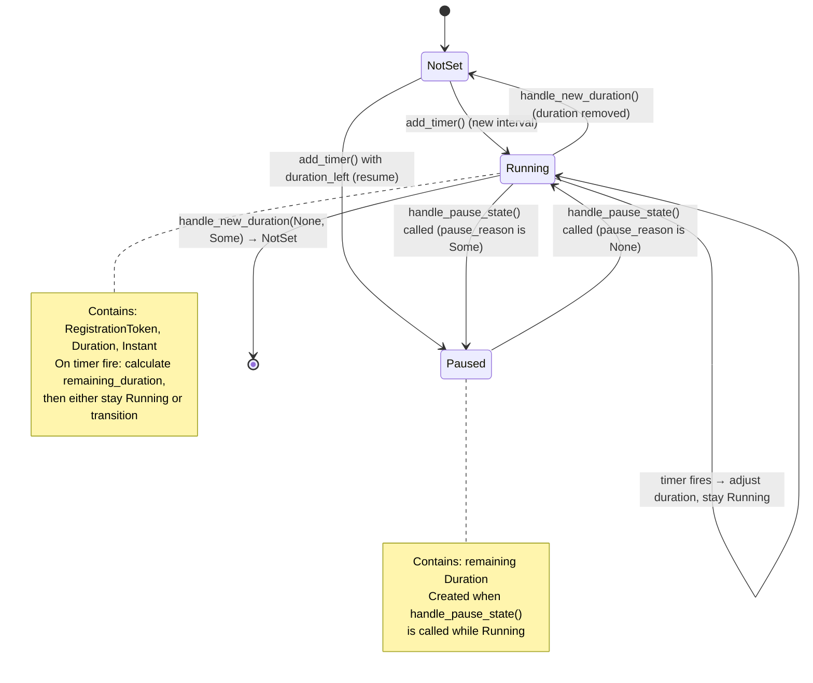

### Timer Transition Details

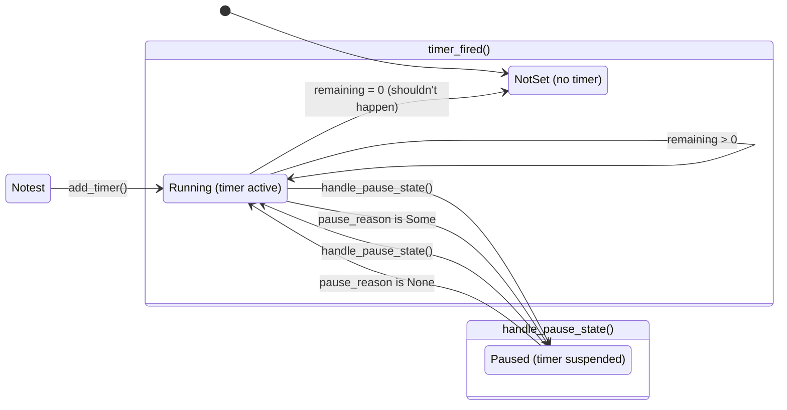

---

## 3. PauseReason State Machine

Controls whether automatic cycling is paused and why.

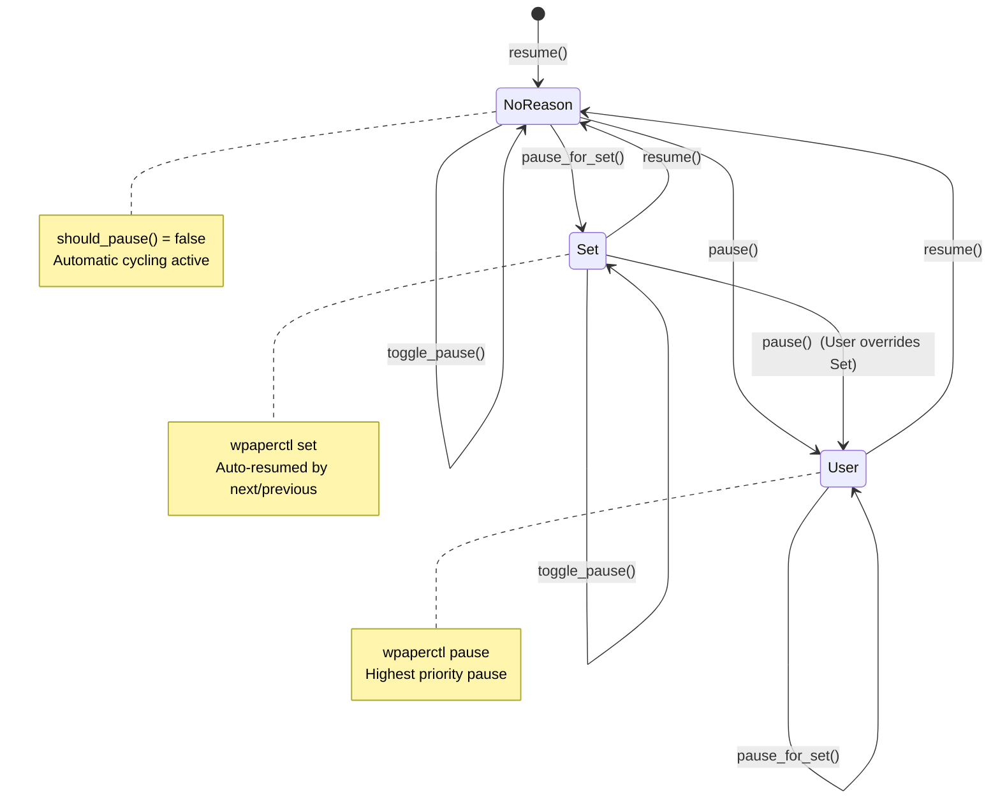

---

## 4. Wallpaper Loading Pipeline

The detailed flow from `load_wallpaper()` through image rendering.

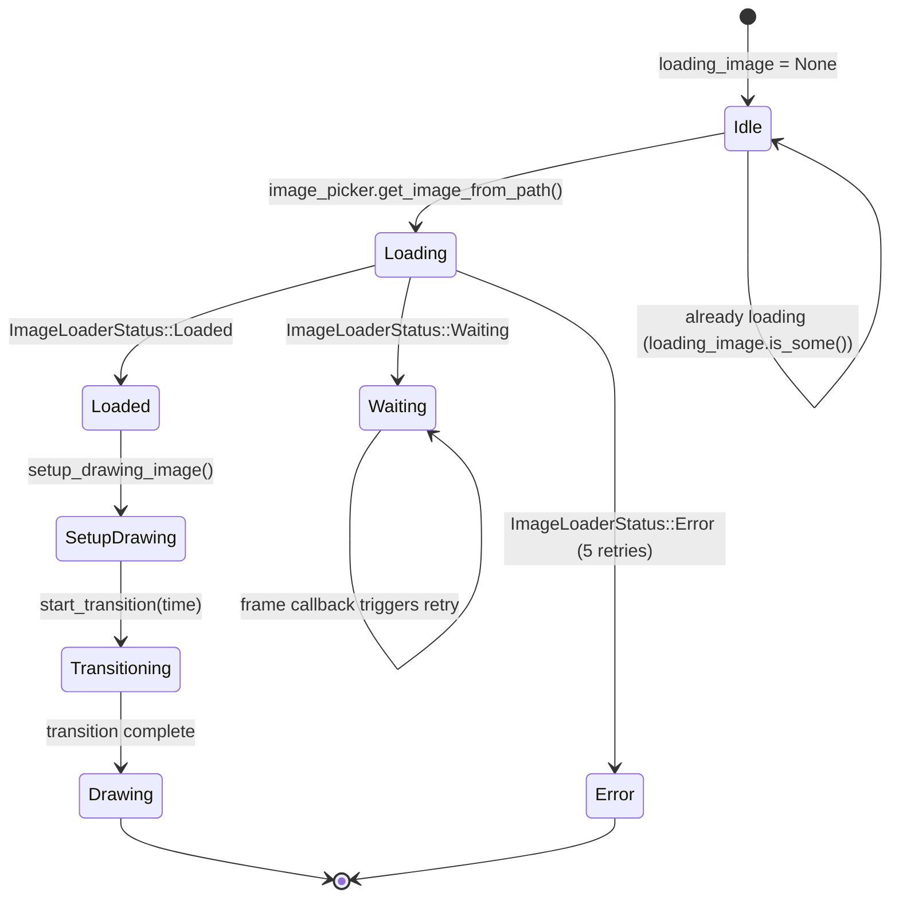

### Loading Pipeline Detail

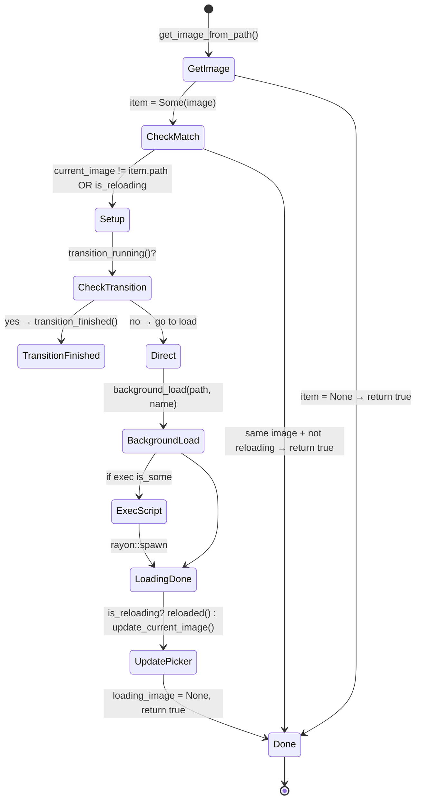

---

## 5. Draw Loop (Frame Callback Cycle)

How the Wayland frame callback drives the rendering loop.

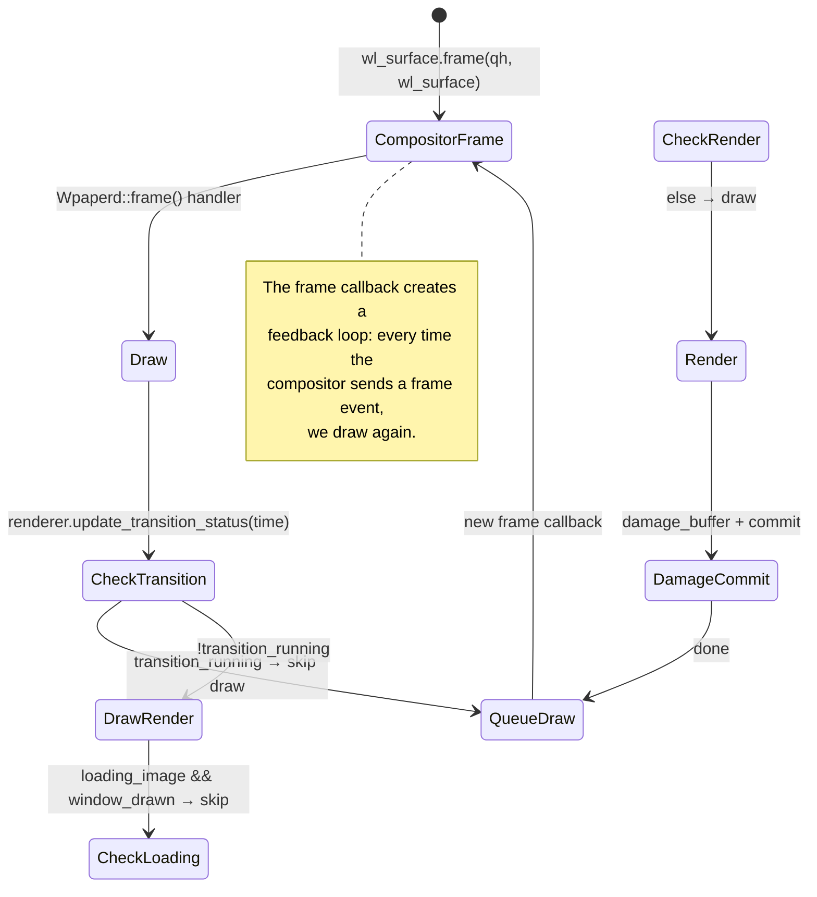

---

## 6. Complete Surface State Composite

A comprehensive view combining all state variables into one diagram.

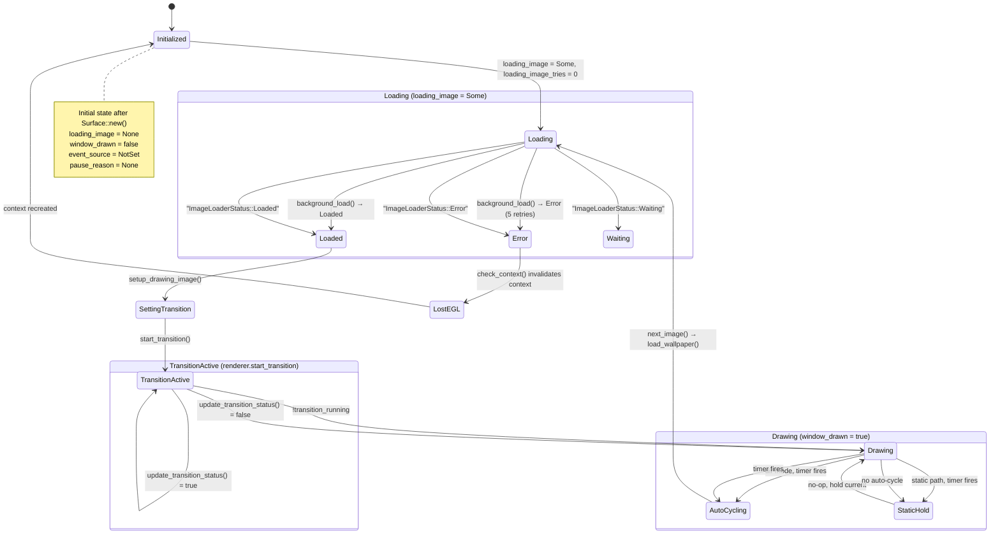

---

## 7. Event Source State Transitions (Timer Logic)

Detailed transitions for the `EventSource` enum with `handle_new_duration()`.

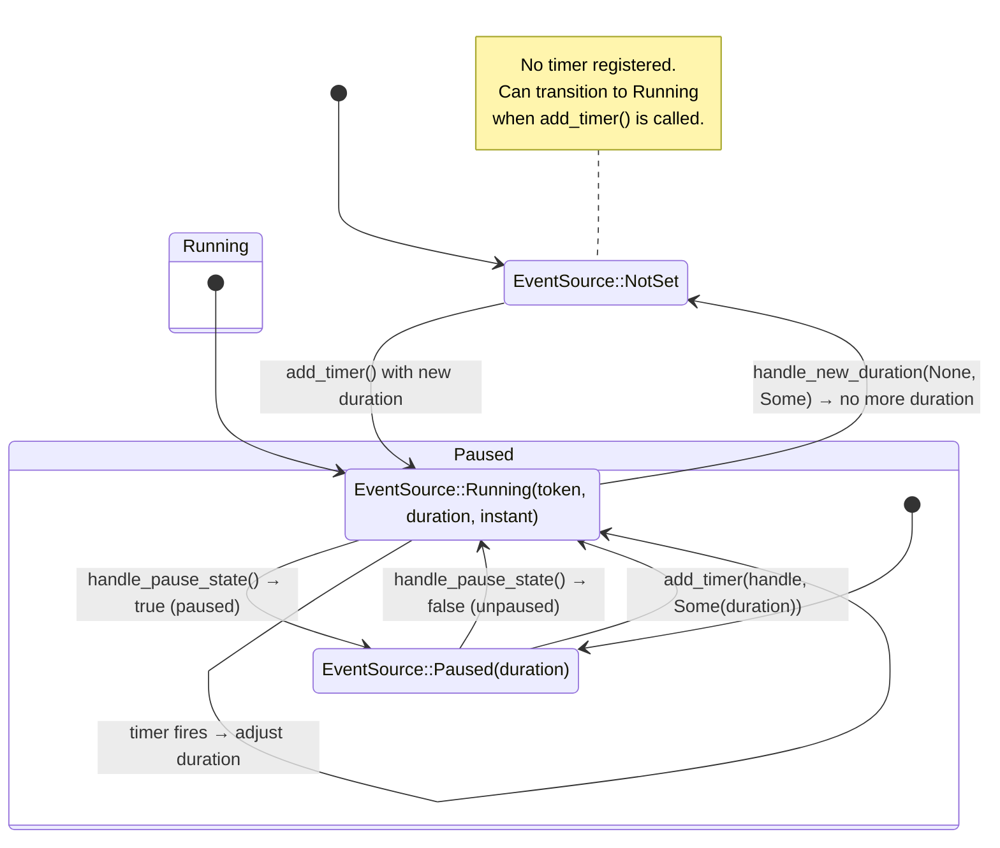

---

## 8. `update_wallpaper_info()` Flow

The main configuration update method that handles path changes, mode changes, transitions, and queue updates.

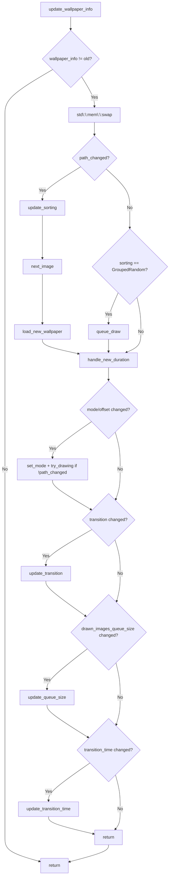

---

## 9. Key Data Flow: Frame to Draw to Commit

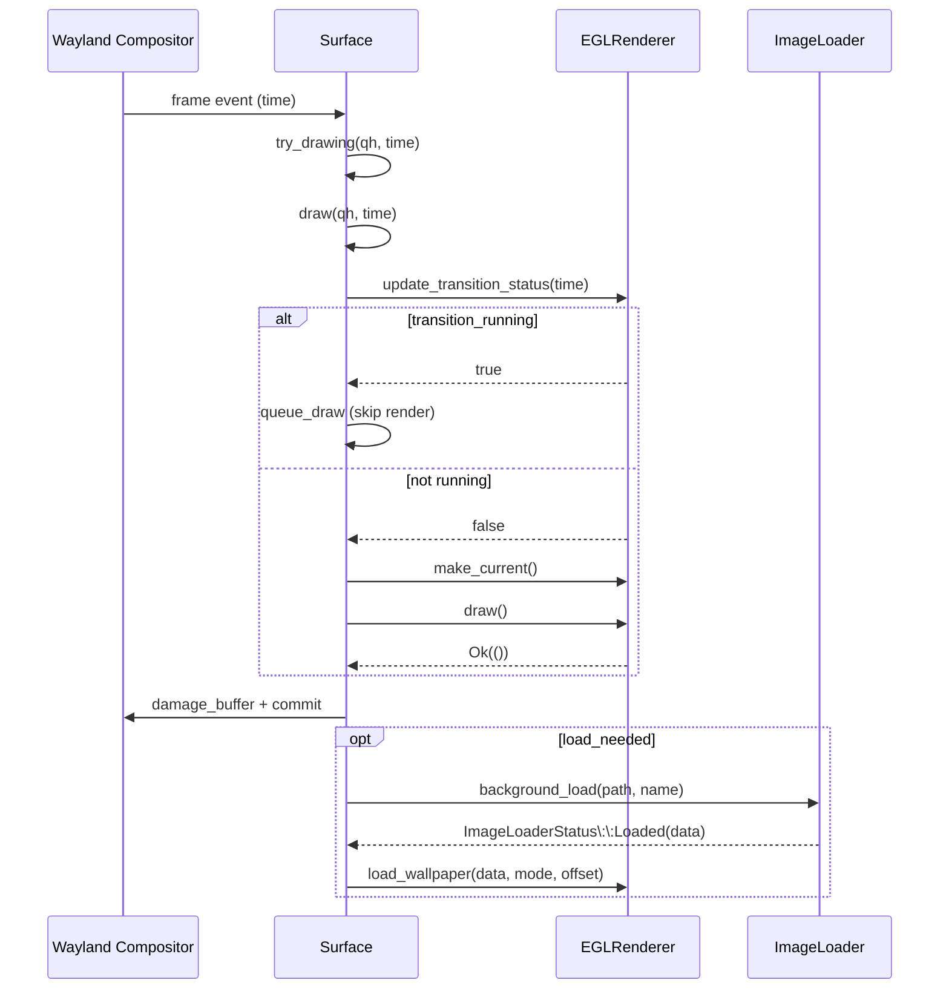

---

## 10. `handle_pause_state()` Decision Matrix

The logic for pausing/resuming the timer based on `pause_reason`:

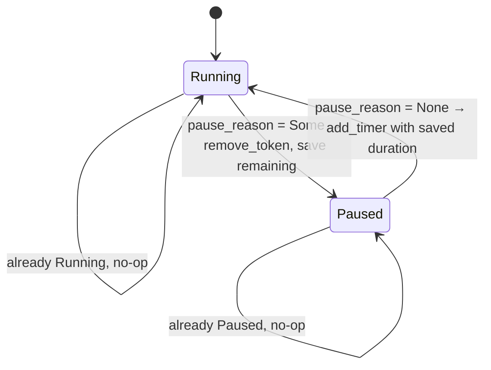

---

## Field Summary

| Field | Type | Purpose |
|-------|------|---------|
| `event_source` | `EventSource` | Timer state: NotSet/Running/Paused |
| `pause_reason` | `Option<PauseReason>` | Why paused: User, Set, or None |
| `loading_image` | `Option<ImageResult>` | Currently loading image (None = idle) |
| `loading_image_tries` | `u8` | Retry counter for load failures (max 5) |
| `window_drawn` | `bool` | Whether we've drawn at least once |
| `skip_next_transition` | `bool` | Skip first transition (startup) |
| `wl_surface` | `WlSurface` | Wayland surface for frame callbacks |
| `context` | `Option<EglContext>` | EGL context (None = lost, needs recreate) |
